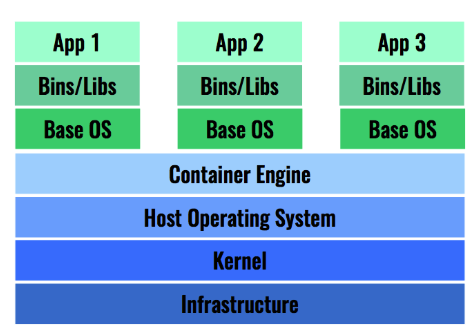
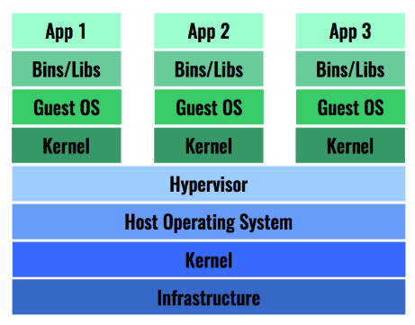

# Long Polling Recipe in Go and Go Deployment as a Docker Container

This is a 2 part recipe:

* An example of client-server long polling system written in Go.
* Encapsulate a Go app in a Docker file and deploy as docker container.

## Long Poll Recipe

50% of the time, the server will respond to incoming requests immediately with an event. The other 50% of the time, an event can take 1 to 10 seconds to surface. But the server will time out 5 seconds after receiving the request and the client will have to poll again. This is just a simulation, no actually events are being generated in the background.

Both the server and client will run concurrently in a main function.

## Docker Recipe

As a best practice, it is desirable to perform a multi-stage to reduce the size and security of the Docker images. There are different Dockerfiles in this project that demonstrates the final image sizes produced from the build. Change the `docker-compose.yaml` to switch to a different Dockerfile.

Here is the final image sizes:

| Dockerfile                  | Image Size (MB) |
|-----------------------------|----------------:|
| Dockerfile.single.ubuntu    | 880.0           |
| Dockerfile.single.alpine    | 382.0           |
| Dockerfile.multi.ubuntu     | 107.0           |
| Dockerfile.multi.alpine     | 15.4            |
| Dockerfile.multi.distroless | 7.6             |
| Dockerfile.multi.scratch    | 7.1             |

### Scratch Base Image

For extreme image reduction (and more secure), build your Docker image using the base image `scratch`, which essentially means no base operating system present in the Docker container - hence scratch. A Docker container without a base OS should still function. See diagram below.



In contrast, a virtual machine VM has a completely isolated virtual execution space. See below:



In a scratch-based container, this means that the application in the Docker container must run on its own and must not have any dependency on any runtime library. Go is the perfect language for constructing such application as we can compile everything we need into a single binary with all dependent libraries statically linked. To do this you need to build the Go application this way:

```bash
GOOS=linux GOARCH=amd64 go build -ldflags="-w -s" -o /app/long-poll
```

## Setup

### Running the App

1. Run the program to launch the client and server.

   ```bash
   $ go run main.go
   ```

1. Call the server

   ```bash
   $ curl -i http://localhost:8000/
   ```

1. You can also run both the client and server at the same time.

   ```bash
   $ ENABLE_CLIENT=true go run main.go
   ```

   Alternatively, you can also run the above.

   ```bash
   $ make
   ```

### Build and Running Docker

1. Edit `docker-compose.yaml` to change the Dockerfile you wish to build and run.

1. Build the docker image.

   ```bash
   $ docker-compose build
   ```

1. Run the docker image.

   ```bash
   $ docker-compose up
   ```

1. Call the server.


   ```bash
   $ curl -i http://localhost:8000/
   ```

1. Teardown the Docker container when you are done.

   ```bash
   $ docker-compose down
   ```

## Reference and Credits

* [Dockerfile Reference](https://docs.docker.com/engine/reference/builder/)
* [Docker Compose File Version 3](https://docs.docker.com/compose/compose-file/)
* [Github: Smallest, Secured Golang Docker Image](https://github.com/chemidy/smallest-secured-golang-docker-image)
